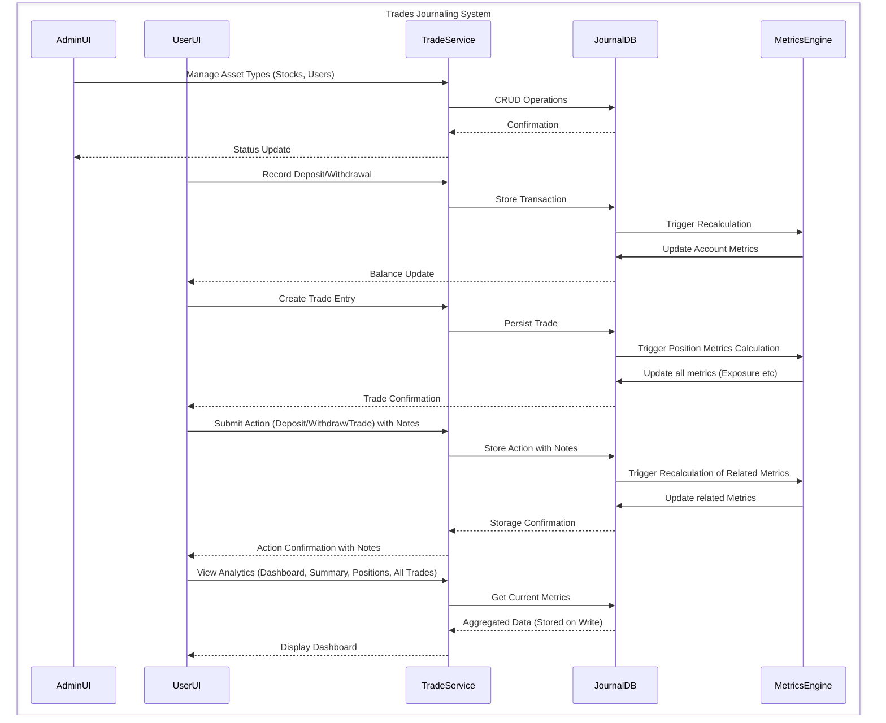

```mermaid
sequenceDiagram
box Trades Journaling System
participant AdminUI
participant UserUI
participant TradeService
participant JournalDB
participant MetricsEngine
end

%% Admin Flow
AdminUI->>TradeService: Manage Asset Types (Stocks, Users)
TradeService->>JournalDB: CRUD Operations
JournalDB-->>TradeService: Confirmation
TradeService-->>AdminUI: Status Update

%% User Core Flow
UserUI->>TradeService: Record Deposit/Withdrawal
TradeService->>JournalDB: Store Transaction
JournalDB->>MetricsEngine: Trigger Recalculation
MetricsEngine->>JournalDB: Update Account Metrics
JournalDB-->>UserUI: Balance Update

UserUI->>TradeService: Create Trade Entry
TradeService->>JournalDB: Persist Trade
JournalDB->>MetricsEngine: Trigger Position Metrics Calculation
MetricsEngine->>JournalDB: Update all metrics (Exposure etc)
JournalDB-->>UserUI: Trade Confirmation

%% Updated Note Handling Flow
UserUI->>TradeService: Submit Action (Deposit/Withdraw/Trade) with Notes
TradeService->>JournalDB: Store Action with Notes
JournalDB->>MetricsEngine: Trigger Recalculation of Related Metrics
MetricsEngine ->> JournalDB: Update related Metrics
JournalDB-->>TradeService: Storage Confirmation
TradeService-->>UserUI: Action Confirmation with Notes

%% Analytics Flow Eg
UserUI->>TradeService: View Analytics (Dashboard, Summary, Positions, All Trades)
TradeService->>JournalDB: Get Current Metrics
JournalDB-->>TradeService: Aggregated Data (Stored on Write)
TradeService-->>UserUI: Display Dashboard

```