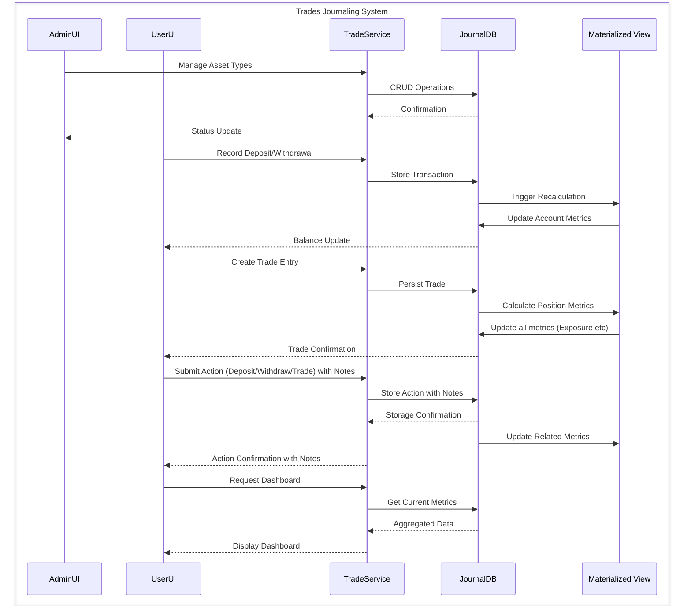

```mermaid
sequenceDiagram
box Trades Journaling System
participant AdminUI
participant UserUI
participant TradeService
participant JournalDB
participant Materialized View
end

%% Admin Flow
AdminUI->>TradeService: Manage Asset Types
TradeService->>JournalDB: CRUD Operations
JournalDB-->>TradeService: Confirmation
TradeService-->>AdminUI: Status Update

%% User Core Flow
UserUI->>TradeService: Record Deposit/Withdrawal
TradeService->>JournalDB: Store Transaction
JournalDB->>Materialized View: Trigger Recalculation
Materialized View->>JournalDB: Update Account Metrics
JournalDB-->>UserUI: Balance Update

UserUI->>TradeService: Create Trade Entry
TradeService->>JournalDB: Persist Trade
JournalDB->>Materialized View: Calculate Position Metrics
Materialized View->>JournalDB: Update all metrics (Exposure etc)
JournalDB-->>UserUI: Trade Confirmation

%% Updated Note Handling Flow
UserUI->>TradeService: Submit Action (Deposit/Withdraw/Trade) with Notes
TradeService->>JournalDB: Store Action with Notes
JournalDB-->>TradeService: Storage Confirmation
JournalDB->>Materialized View: Update Related Metrics
TradeService-->>UserUI: Action Confirmation with Notes

%% Analytics Flow Eg
UserUI->>TradeService: Request Dashboard
TradeService->>JournalDB: Get Current Metrics
%% TradeService->>Materialized View: Get Current Metrics
%% Materialized View->>JournalDB: Query Open Positions
%% Materialized View->>JournalDB: Get Account History
JournalDB-->>TradeService: Aggregated Data
TradeService-->>UserUI: Display Dashboard
```